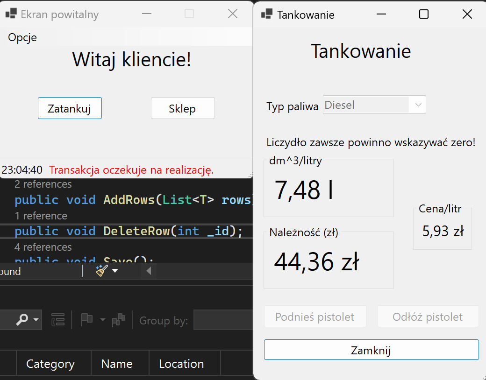
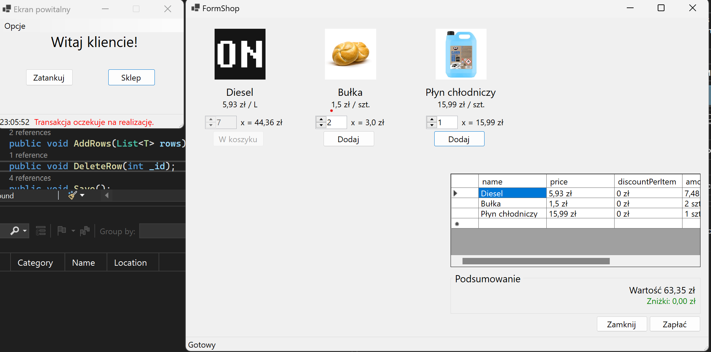

# Kolejny projekt na przedmiot programowania

## Screeny jakieś

### Ekran powitalny

### Tankowanie

### Sklep

### Zestawienia i opcje dodawania rzeczy do bazy różnych

### Zestawienia

### Dodawanie różnych rzeczy do bazy, okno dobiera pola w zależności od tego, co chcesz dodać

### Prymitywna relacyjna baza danych (tak bardzo chciałem zrobić swoją, a czemu nie)
